# Entorno de pruebas

En este apartado vamos a montar un entorno de pruebas basado en un servidor LAMP, que utilizaremos más adelante para realizar distintas prácticas. En dichas actividades introduciremos archivos con vulnerabilidades de forma intencionada, con el objetivo de analizarlas y aplicar posteriormente las correcciones necesarias.

Existen varias formas de crear este entorno, entre las que destacan las siguientes:

1. Crear una máquina virtual e instalar manualmente todos los componentes necesarios, ya sea una pila `LAMP`, `LEMP`, `MEAN`, `XAMPP`, `WAMP` o `AMPPS`.

2. Desplegar un escenario multicontenedor, utilizando Docker y alguna de estas pilas ya preparadas.

Para este caso optaremos por la segunda alternativa, creando un entorno multicontenedor a partir de una pila disponible en Docker Hub
. En concreto, se ha utilizado el siguiente repositorio, elegido por su sencillez y rapidez de puesta en marcha:
https://github.com/sprintcube/docker-compose-lamp.git

Si revisamos el repositorio en GitHub, el propio autor indica los pasos necesarios para replicar el escenario:

```bash
git clone https://github.com/sprintcube/docker-compose-lamp.git
cd docker-compose-lamp/
cp sample.env .env
```

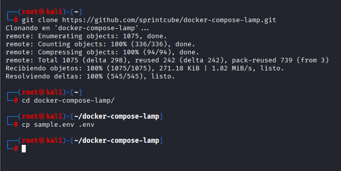

Esto se traduce en:

- Clonar el repositorio en nuestro sistema.
- Acceder al directorio del proyecto.
- Copiar el archivo `sample.env` creando un nuevo fichero `.env`.

Este archivo .env es especialmente importante, ya que contiene las variables de entorno que utilizarán los distintos contenedores. Es altamente recomendable modificar los valores por defecto, especialmente las contraseñas.

Al abrir el fichero `.env`, nos encontramos con un contenido similar al siguiente:

`sample.env`

```
# Please Note:
# In PHP Versions <= 7.4 MySQL8 is not supported due to lacking pdo support

# To determine the name of your containers
COMPOSE_PROJECT_NAME=lamp

# Possible values: php54, php56, php71, php72, php73, php74, php8, php81, php82, php83
PHPVERSION=php83
DOCUMENT_ROOT=./www
APACHE_DOCUMENT_ROOT=/var/www/html
VHOSTS_DIR=./config/vhosts
APACHE_LOG_DIR=./logs/apache2
PHP_INI=./config/php/php.ini
SSL_DIR=./config/ssl

# PHPMyAdmin
UPLOAD_LIMIT=512M
MEMORY_LIMIT=512M

# Xdebug
XDEBUG_LOG_DIR=./logs/xdebug
XDEBUG_PORT=9003
#XDEBUG_PORT=9000

# Possible values: mysql57, mysql8, mariadb103, mariadb104, mariadb105, mariadb106
#
# For Apple Silicon User: 
# Please select Mariadb as Database. Oracle doesn't build their SQL Containers for the arm Architecure

DATABASE=mysql8
MYSQL_INITDB_DIR=./config/initdb
MYSQL_DATA_DIR=./data/mysql
MYSQL_LOG_DIR=./logs/mysql

# If you already have the port 80 in use, you can change it (for example if you have Apache)
HOST_MACHINE_UNSECURE_HOST_PORT=80

# If you already have the port 443 in use, you can change it (for example if you have Apache)
HOST_MACHINE_SECURE_HOST_PORT=443

# If you already have the port 3306 in use, you can change it (for example if you have MySQL)
HOST_MACHINE_MYSQL_PORT=3306

# If you already have the port 8080 in use, you can change it (for example if you have PMA)
HOST_MACHINE_PMA_PORT=8080
HOST_MACHINE_PMA_SECURE_PORT=8443

# If you already has the port 6379 in use, you can change it (for example if you have Redis)
HOST_MACHINE_REDIS_PORT=6379

# MySQL root user password
MYSQL_ROOT_PASSWORD=tiger

# Database settings: Username, password and database name
#
# If you need to give the docker user access to more databases than the "docker" db 
# you can grant the privileges with phpmyadmin to the user.
MYSQL_USER=docker
MYSQL_PASSWORD=docker
MYSQL_DATABASE=docker
```

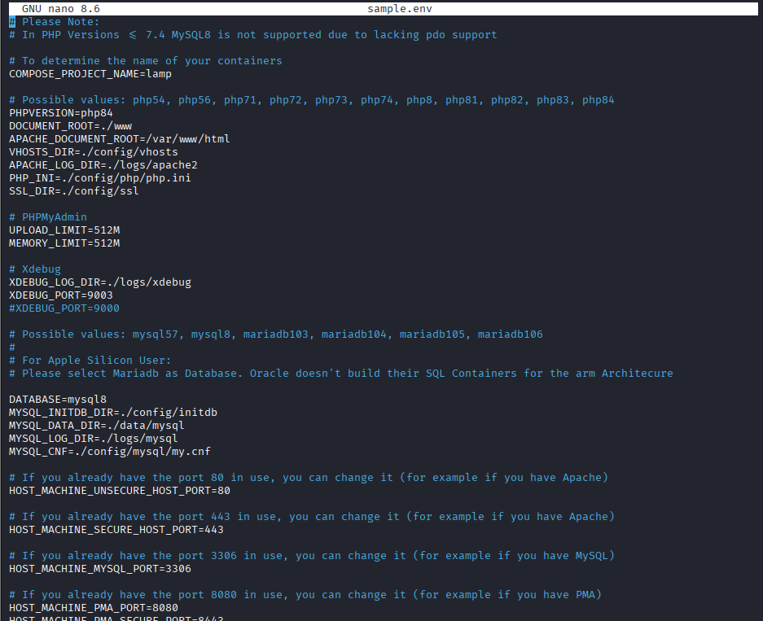

Como puede observarse, muchas de estas variables definen versiones, rutas y nombres, mientras que otras hacen referencia a credenciales y puertos. Desde aquí podemos modificar, entre otras cosas:

- La versión de PHP y del sistema gestor de bases de datos.

- Las rutas de configuración del servidor web.

- Los certificados SSL.

- Los puertos expuestos.

- Las credenciales y el nombre de la base de datos.

Conviene recordar que dentro del Top 10 de OWASP se encuentra la categoría de Configuración Insegura. Muchas vulnerabilidades están relacionadas con el uso de contraseñas o configuraciones por defecto.Por ello, como mínimo, se recomienda cambiar:

- Los puertos por defecto.
- Las contraseñas del administrador y del usuario de la BBDD.
- El nombre de la base de datos y del usuario.

## Copia de seguridad de la configuración inicial

A lo largo de esta unidad se realizarán múltiples prácticas relacionadas con la securización y mitigación de vulnerabilidades, lo que implicará modificar archivos de configuración. Para poder volver atrás cuando sea necesario, realizaremos una copia de seguridad del estado inicial.

Desde el directorio del proyecto ejecutamos:

```bash
mkdir configuracionOriginal
cp -rp config data logs www configuracionOriginal/
```

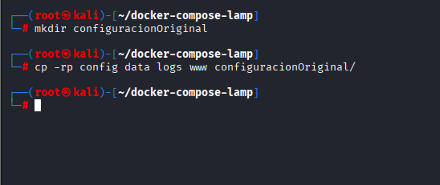

**De esta forma almacenamos una copia completa de las carpetas más importantes.**

> Además, se proporcionan dos scripts: `guardarConfiguraciones.sh` y `restaurarConfiguracionOriginal.sh`

Este es el archivo `docker-compose.yml`

`docker-compose.yml`
```yaml
services:
  webserver:
    build:
      context: ./bin/${PHPVERSION}
    container_name: "${COMPOSE_PROJECT_NAME}-${PHPVERSION}"
    restart: "always"
    ports:
      - "${HOST_MACHINE_UNSECURE_HOST_PORT}:80"
      - "${HOST_MACHINE_SECURE_HOST_PORT}:443"
    links:
      - database
    volumes:
      - ${DOCUMENT_ROOT-./www}:/var/www/html:rw
      - ${PHP_INI-./config/php/php.ini}:/usr/local/etc/php/php.ini
      - ${SSL_DIR-./config/ssl}:/etc/apache2/ssl/
      - ${VHOSTS_DIR-./config/vhosts}:/etc/apache2/sites-enabled
      - ${LOG_DIR-./logs/apache2}:/var/log/apache2
      - ${XDEBUG_LOG_DIR-./logs/xdebug}:/var/log/xdebug
    environment:
      APACHE_DOCUMENT_ROOT: ${APACHE_DOCUMENT_ROOT-/var/www/html}
      PMA_PORT: ${HOST_MACHINE_PMA_PORT}
      MYSQL_ROOT_PASSWORD: ${MYSQL_ROOT_PASSWORD}
      MYSQL_USER: ${MYSQL_USER}
      MYSQL_PASSWORD: ${MYSQL_PASSWORD}
      MYSQL_DATABASE: ${MYSQL_DATABASE}
      HOST_MACHINE_MYSQL_PORT: ${HOST_MACHINE_MYSQL_PORT}
      XDEBUG_CONFIG: "client_host=host.docker.internal remote_port=${XDEBUG_PORT}"
    extra_hosts:
      - "host.docker.internal:host-gateway"
  database:
    build:
      context: "./bin/${DATABASE}"
    container_name: "${COMPOSE_PROJECT_NAME}-${DATABASE}"
    restart: "always"
    ports:
      - "127.0.0.1:${HOST_MACHINE_MYSQL_PORT}:3306"
    volumes:
      - ${MYSQL_INITDB_DIR-./config/initdb}:/docker-entrypoint-initdb.d
      - ${MYSQL_DATA_DIR-./data/mysql}:/var/lib/mysql
      - ${MYSQL_LOG_DIR-./logs/mysql}:/var/log/mysql
      - ${MYSQL_CNF-./config/mysql/my.cnf}:/etc/my.cnf
    environment:
      MYSQL_ROOT_PASSWORD: ${MYSQL_ROOT_PASSWORD}
      MYSQL_DATABASE: ${MYSQL_DATABASE}
      MYSQL_USER: ${MYSQL_USER}
      MYSQL_PASSWORD: ${MYSQL_PASSWORD}
  phpmyadmin:
    image: phpmyadmin
    container_name: "${COMPOSE_PROJECT_NAME}-phpmyadmin"
    links:
      - database
    environment:
      PMA_HOST: database
      PMA_PORT: 3306
      PMA_USER: root
      PMA_PASSWORD: ${MYSQL_ROOT_PASSWORD}
      MYSQL_ROOT_PASSWORD: ${MYSQL_ROOT_PASSWORD}
      MYSQL_USER: ${MYSQL_USER}
      MYSQL_PASSWORD: ${MYSQL_PASSWORD}
      UPLOAD_LIMIT: ${UPLOAD_LIMIT}
      MEMORY_LIMIT: ${MEMORY_LIMIT}
    ports:
      - "${HOST_MACHINE_PMA_PORT}:80"
      - "${HOST_MACHINE_PMA_SECURE_PORT}:443"
    volumes:
      - /sessions
      - ${PHP_INI-./config/php/php.ini}:/usr/local/etc/php/conf.d/php-phpmyadmin.ini
  redis:
    container_name: "${COMPOSE_PROJECT_NAME}-redis"
    image: redis:latest
    ports:
      - "127.0.0.1:${HOST_MACHINE_REDIS_PORT}:6379"

```

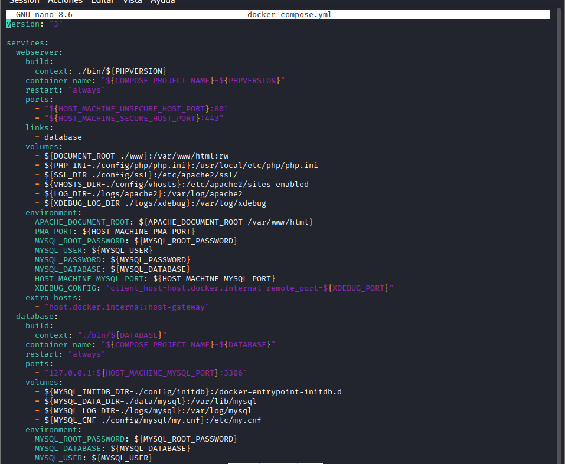

Se levantan tres servicios o contenedores:

1. Servicio `__webserver__` que nos proveerá del servicio web con una máquina Apache con el PHP que hayamos decidido.
2. Servicio `__database__` que contrendrá la base de datos mySQL8.
3. Un servidor web para administrar la Base de datos: `__phpyadmin__`.
4. Una base de datos no SQL: `__Redis__`, que se suele utilizar como caché de aplicaciones.

Y ahora levantamos el escenario multicontenedor:

```bash
docker compose up -d
```

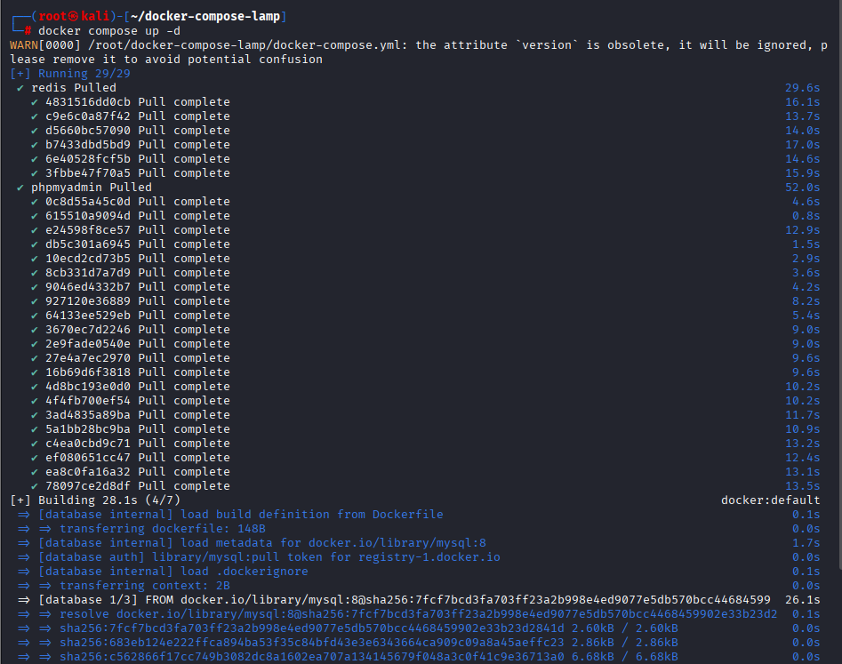

## Scripts para guardar y restaurar configuraciones.

Hemos creado anteriormente una copia de seguridad de la configuración original en un directorio con nombre `configuracionOriginal`.
Vamos a crear un par de scripts para guardar y para restaurar la configuración original cuando lo necesitemos: 

- Script `guardarConfiguraciones.sh` nos va a permitir guardar las configuraciones y datos del escenario.

Creamos el archivo y copia el contenido en su interior:
```bash
nano guardarConfiguraciones.sh
```

```bash
#  guardarConfiguraciones.sh Directorio_Configuracion_a_Guardar
# Con este script guardamos las configuraciones actuales del  Escenario LAMP

#!/bin/bash
if [ $# -ne 1 ]; then
    echo "Introduce la ruta de la carpeta donde quieres guardar la configuración existente"
    echo "Uso: guardarConfiguraciones.sh ruta_a_Directorio_Configuracion"
    echo "Se creará la carpeta con  el ruta y nombre indicados."
    exit
fi

if [ ! -d configuracionOriginal ]; then
    echo "no estas en el directorio correcto."
    echo "Situate en la carpeta del repositorio, en tu directorio debe de encontrarse la carpeta configuracionOriginal"
    exit
fi

# Comprobamos que la carpeta no exista ya
if [ -d "$1" ]; then
    echo "La carpeta $1 ya existe. Por favor, elige otro nombre o elimina la carpeta existente."
    exit        

# solicitamos confirmación al usuario sobre la acción a realizar
read -r -p "¿Estás seguro de que quieres guardar la configuración actual? (s/n): " confirmation
if [[ $confirmation != [sS] ]]; then
    echo "Acción de guardar datos cancelada."
    exit 0
fi
# Creamos la carpeta especificada y copiamos los datos y configuraciones indicados en dicha carpeta.
mkdir -p "$1"
cp -rp config data logs www "$1"
echo "Configuración guardada correctamente en la carpeta $1"
```

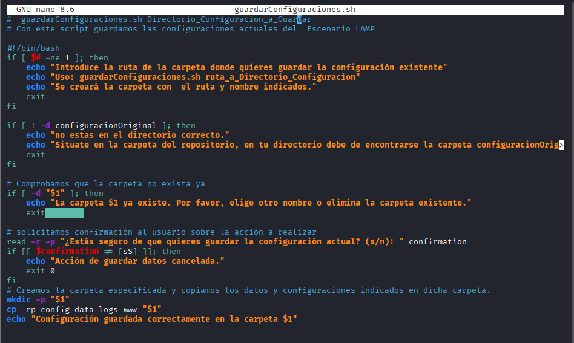


Para usarlo tendremos que ejecutarlo con un nombre de carpeta que se creará y contendrá esa configuración. La carpeta no debe de existir, si no, tendremos que borrarla.

```bash
./guardarConfiguraciones.sh nombre_carpeta
```
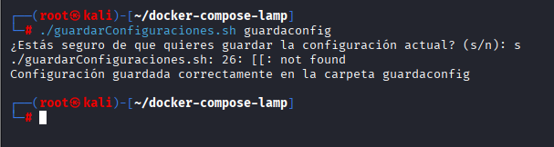

El segundo script tiene por nombre`restaurarConfiguracionOriginal.sh` y restaura la configuración original para deshacer los cambios que hayamos hecho en una actividad.
Crea el archivo y copia el contenido en su interior:

```bash
nano restaurarConfiguracionOriginal.sh
```

```bash
# restaurarConfiguracionOriginal.sh Directorio_Configuracion_a_Guardar
# Con este script restauramos la configuración original del  Escenario LAMP
# pero primero guardamos 
if [ $# -ne 0 ]; then
    
    echo "Uso: restaurarConfiguracionOriginal.sh" 
    echo "Script para restaurar la configuración original del entorno de prueba."
    exit
fi

if [ ! -d configuracionOriginal ]; then
    echo "no estas en el directorio correcto."
    echo "Situate en la carpeta del repositorio, en tu directorio debe de encontrarse la carpeta configuracionOriginal"
    exit
fi
read -r -p "¿Estás seguro de que quieres restaurar la configuración original? Se perderán los datos actuales. (s/n): " confirmation
if [[ $confirmation != "s" ]]; then
    echo "Restauración cancelada."
    exit
fi
# Borramos los datos y configuraciones existentes
rm -rf config/* data/* logs/* www/* 
# Copiamos los datos y configuraciones por defecto
cp -rp configuracionOriginal/config configuracionOriginal/data configuracionOriginal/logs configuracionOriginal/www ./
echo "Configuración por defecto restaurada correctamente"
```
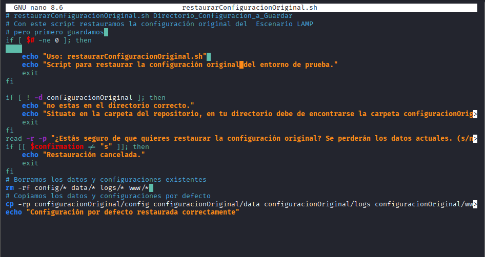

 
Para usarlo, solo hay que ejecutarlo.

```bash
./restaurarConfiguracionOriginal.sh
```

## Entorno ya construido

Tenemos creados diferentes volúmenes bind mount, por lo tanto la configuración, datos de BBDD, etc se van a guardar en nuestro sistema anfitrión, concretamente las carpetas: `config`, `data`, `logs` y `www`.

Por lo tanto para hacer cualquier modificación en la configuración no es necesario que entremos en el contenedor para cambiarlo, sería suficiente con cambiar los archivos en nuestra máquina.

Por ejemplo creamos un archivo html sencillo con nombre `misaludo.html` y como puedo verlo en la dirección <http://localhost/misaludo.html>

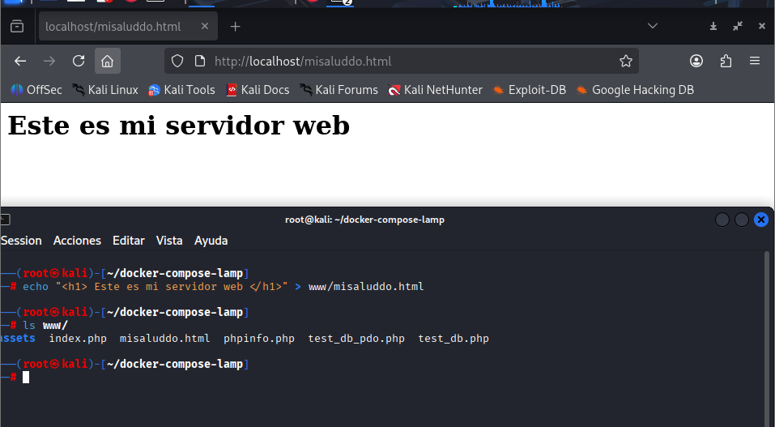

Podemos acceder al servidor web a traves de:

-  <http://localhost>

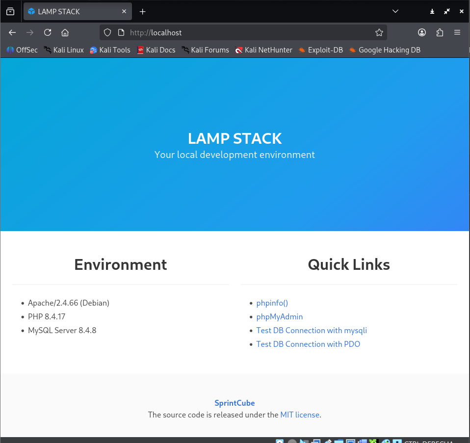

- `https` por <http://localhost:443>

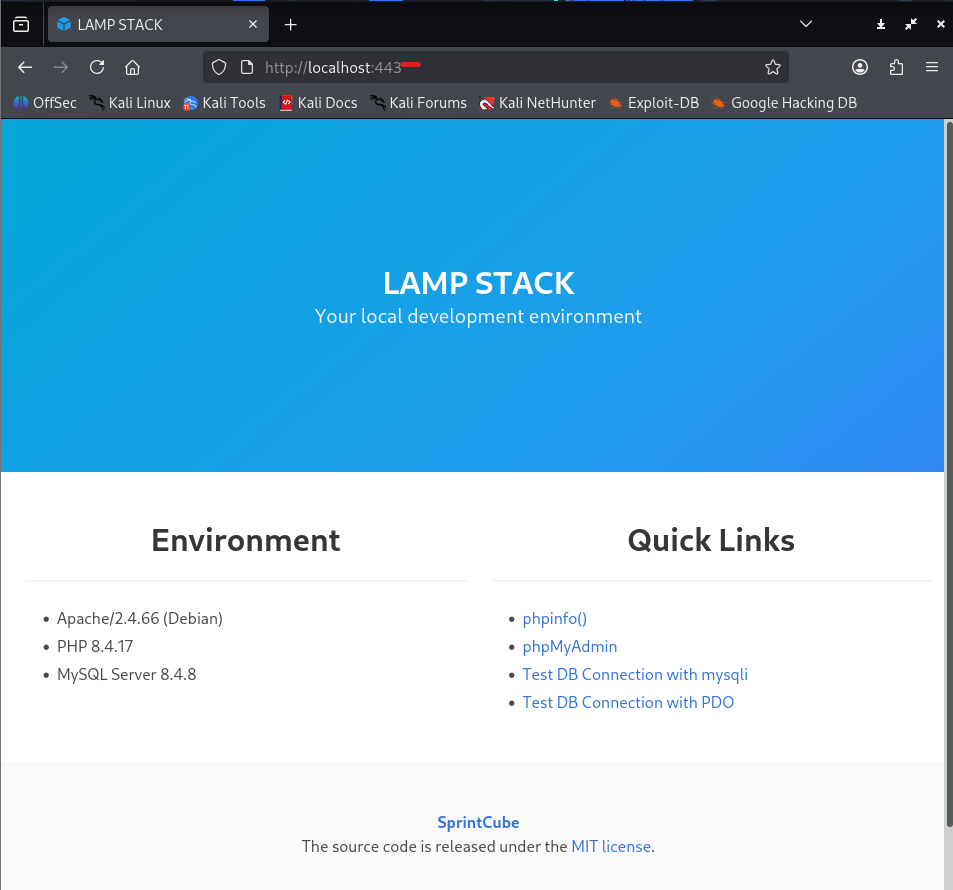

La dinámica de trabajo para ensayar los ataques y sus mitigaciones será la siguiente:

- Crear los ficheros necesarios dentro de nuestro directorio `www`.

- Reiniciar los servicios cuando sea preciso, por ejemplo con `docker exec lamp-php84 /bin/bash -c "service apache2 restart"`.

- Verificar el comportamiento obtenido o seguir ajustando los archivos hasta lograr una configuración más segura.

También  podemos consultar el estado de los contenedores con `docker compose ps` y acceder a cualquiera de ellos mediante `docker exec -it Nombre_contenedor /bin/bash`. Por ejemplo, para el contenedor del servidor web: `docker exec -it lamp-php84 /bin/bash`.